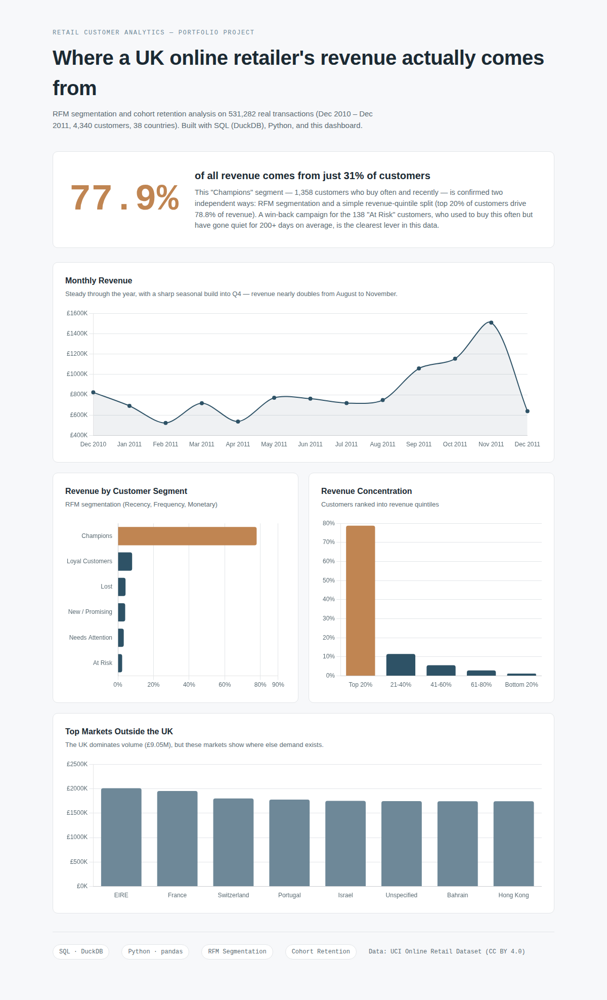

# Retail Customer Analytics: RFM Segmentation & Retention

**Business question:** Which customers actually drive this retailer's revenue, and where's the clearest opportunity to protect or grow it?



## Key Finding

**77.9% of revenue comes from 31% of customers** ("Champions" — 1,358 customers who buy often and recently). This was confirmed two independent ways: RFM segmentation and a simple revenue-quintile split (top 20% of customers separately account for 78.8% of revenue). Meanwhile, a small "At Risk" segment (138 customers, 3.2% of the base) used to buy just as frequently as Champions but hasn't purchased in 204 days on average — the clearest, most targeted win-back opportunity in the data.

## Dataset

[UCI Online Retail Dataset](https://archive.ics.uci.edu/dataset/352/online+retail) (CC BY 4.0) — 531,282 real transactions from a UK-based online gift retailer, December 2010 to December 2011. 4,340 customers across 38 countries. This is real transactional data, not a synthetic or toy dataset.

## Approach

1. **SQL (DuckDB)** — normalized the flat transaction file into a relational schema (`customers`, `invoices`, `invoice_items`) and wrote queries using JOINs, subqueries, window functions, and aggregations to answer specific business questions. See `sql/`.
2. **Python (pandas)** — calculated Recency, Frequency, and Monetary value per customer, segmented them into six behavioral groups, and built a month-over-month cohort retention table. See `scripts/rfm_analysis.py`.
3. **Visualization** — static charts for the write-up (`scripts/build_visuals.py` → `visuals/`) and an interactive web dashboard (`index.html`) built with Chart.js, so the results are viewable without any BI software installed.

## Findings

| Segment | % of Customers | % of Revenue | Avg. Days Since Last Purchase | Avg. Orders |
|---|---|---|---|---|
| Champions | 31.3% | 77.9% | 17 | 10.8 |
| Loyal Customers | 15.5% | 8.0% | 61 | 3.9 |
| Lost | 21.8% | 4.3% | 253 | 1.2 |
| New / Promising | 13.6% | 4.1% | 26 | 1.4 |
| Needs Attention | 14.6% | 3.3% | 85 | 1.4 |
| At Risk | 3.2% | 2.4% | 204 | 4.2 |

- Revenue is strongly seasonal: **August to November revenue roughly doubles**, consistent with holiday gift-buying (this retailer mainly sells gift-ware).
- Month-1 cohort retention typically runs **15-25%** — most customers who buy once do not return the following month, which makes the small Champions segment even more valuable to protect.
- The UK accounts for the large majority of revenue (£9.05M), but EIRE, France, and Switzerland are the next-largest markets and show consistent demand outside the UK.

## Recommendation

Target the 138 "At Risk" customers with a direct win-back campaign. They have Champion-level purchase frequency historically (4.2 average orders) but have gone quiet — recovering even a third of them back to active status would be a meaningful, low-cost revenue protection move given how concentrated this business's revenue already is.

## Reproducing This Analysis

```bash
pip install -r requirements.txt

# 1. Build the normalized SQL schema and run business queries
duckdb retail.duckdb < sql/01_schema_setup.sql
duckdb retail.duckdb < sql/02_business_queries.sql

# 2. Run RFM segmentation and cohort analysis
python scripts/rfm_analysis.py

# 3. Regenerate charts
python scripts/build_visuals.py

# 4. Open index.html in a browser to view the interactive dashboard
```

## Project Structure

```
├── index.html              # Interactive dashboard (open directly in a browser)
├── assets/                 # Locally-hosted Chart.js (no external CDN dependency)
├── sql/
│   ├── 01_schema_setup.sql     # Normalizes flat data into customers/invoices/invoice_items
│   └── 02_business_queries.sql # JOINs, subqueries, and aggregations answering business questions
├── scripts/
│   ├── rfm_analysis.py     # RFM segmentation + cohort retention (pandas)
│   └── build_visuals.py    # Generates the static charts in visuals/
├── data/                   # Source data (parquet) and analysis outputs (csv)
├── visuals/                # Chart images used in this README
└── case_study.md           # One-page business write-up
```

## Tools

SQL (DuckDB) · Python (pandas) · Chart.js · matplotlib / seaborn

---
*Dataset: Chen, D. (2015). Online Retail [Dataset]. UCI Machine Learning Repository. CC BY 4.0.*
